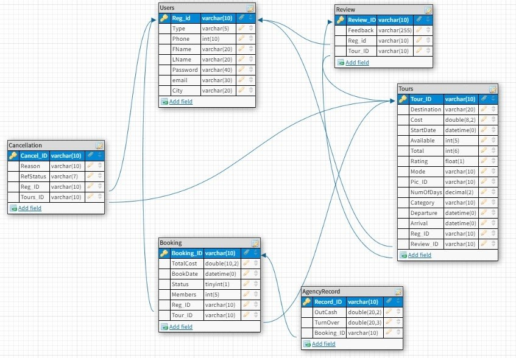

# Tourist Management Webapp
This is a Dynamic Webapp created in java with MySql database. It uses Servlet and JSP concepts to develop backend for the website. The website is deployed in tomcat server.

## Table of Contents
  * [Introduction](#general-info)
  * [Tecnologies](#technologies)
  * [Setup](#setup)
  * [ER Diagram](#ER-Diagram)
  * [RDBMS : MySQL based](#RDBMS)
  * [Table description](#TABLE-DESCRIPTION)
  * [Functionalities](#Functionalities)
  * [Features](#Features)
  * [Describing the web-server environment and  deployment details](#web-server)
 
### Introduction 
 Tourism has turned out to be an economic booster contributing to the economic development of many countries over the last few decades. People see holidays as a necessity, and not as a luxury in the present scenario. With a rich heritage and myriad attractions, India is among the most popular tourist destinations in the world. The pre-COVID times had seen an upsurge of tourists visiting India. Situations like lockdown have made people yearn to travel. Foreseeing the boom in the number of travellers who would visit India post COVID, I attempt to help travellers plan their travel with ease and make their experience a memorable one.

### Technologies 
  - 100% java
  - MySql
  - Dynamic web project
  - Servlet and jsp
  - Eclipse IDE for java EE developers
  - Tomacat Server(8.5v)

### Setup
```
  - Install Eclipse IDE for java EE developers
  - Add apache tomcat server 
  - Add mysql connector jar
  - Configure the build path to add above mentioned features(mysql jar should appear in /lib folder also)
  - Change the port number,username,password to your credential in Database files
```

### ER Diagram
 

### RDBMS : MySQL based
 

### Table description
- User Table :
A RegID is allotted as the person registers him/herself. We ask the user for his/her Name, email, Password, Phone and the City. The Type indicates if the person who is logging in is User or an Admin.  

- Tours Table :
Tours table has TourID, Destination, Cost, NumOfDays  Rating, StartDate of tour is included as a person can book the tour in advance, the Category (if the tour is related to temple visits or beaches or wildlife sanctuaries or any city tour etc), Departure and Arrival times, Mode of transport. The PicID for the respective picture will also be mentioned in the tours table. The Total number of seats, the number of Available seats will also be shown. It has foreign keys RegID, ReviewID

- Booking Table :
The booking table will have details such as BookingID which will be given for every booking. A single booking will be related to the tours table through the TourID. The Status column will have whether the booking is “confirmed”/”cancelled” or is still “processing”.
The TotalCost of the booking will be recorded. We will also record the BookDate because the seats are to be filled on a first come first serve basis.

- Review Table :
The review table has ReviewID for every review, TourID to relate the review to a particular tour and the RegID of the user who has given the rating. The Rating and Feedback given by the user will also be given in the review table

- Cancellation Table :
The cancellation table has the CancelID, TourID, RegID, the Reason for cancellation and also the RefStatus as refund status 

- AgencyRecord Table :
The agency record table is mainly for the agency to manage their expenses. It has a RecordID which is a primary key for that table. The OutCash tells how much money the agency has spent for the particular tour and the TurnOver is the money that the travel agency has received from the user and hence expenses can be managed. It has a BookingID as foreign key.


### Functionalities
- Users (Tourists) can:
Register
Login
Browse through tours available
Search or apply filters 
Book desired packages
View the dashboard 
Check if the booking is confirmed
Cancel the booking
Rate an experience.

- Admins (Tourists agency employees) can:
Log in
See booking details
Confirm a booking based on booking details 
Get the number of people visiting a tourist spot on a monthly/yearly basis
Get to know which place is mostly visited based on bar chart
Manage expenses
Get to know the major reasons for cancellation.

### Features
- Data Access Object Pattern or DAO pattern is used to separate low level data accessing API
- Trigger concept for revtour tables
- Bar Charts for admin to get the insight about which place is more famous these days
- Separate UI and Database pages
- Secure pages cannot be accessed by direct links (login required)
- Registration page for checking all types of conditions based on valid inputs
- Checkpoints added at every page to find the exact page in which error caused if any
- Sessions are used instead of Cookies as it is safer for storing user data because it cannot be modified by the end-user and can only be set on the server-side.

### Describing the web-server environment and  deployment details
```
-- Download tomcat jar file
- go to https://tomcat.apache.org/download-80.cgi
- Download jar file as per your system requirement

-- Extract it(remember the location)
- Tell Eclipse about Tomcat
- Click on the Servers tab at bottom.
- Right-click in window
- New, Server, Apache, Tomcat v8.5,
- Next, navigate to folder where you unzipped Tomcat, Finish

-- Deployed app to Tomcat
- Right-click Tomcat at bottom
- Chose Add and Remove
- Selected ATMA project
- Add arrow
- Press Finish
- Start Project
- Right click on project
- Run as -> Run on server (Select tomcat)

-- Accessing page in browser
- Type:  http://localhost:8080/ATMA_1.0.0/temp/Atma/index.html
```


 

